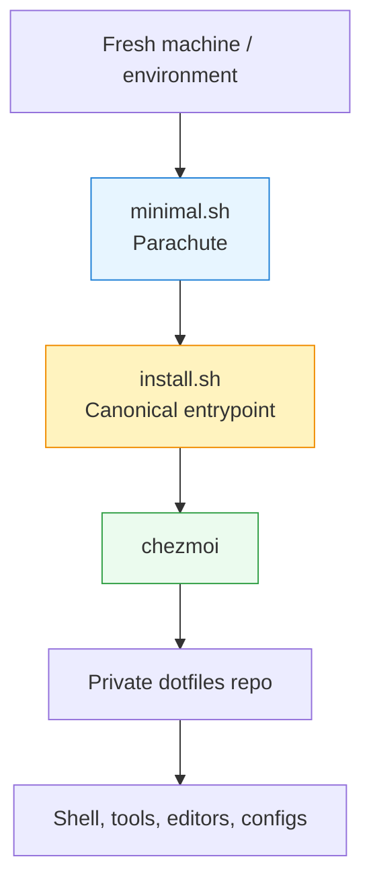

# Dotfiles Bootstrap

This repository is a **public bootstrapper** for my personal dotfiles, which are managed with
[chezmoi](https://www.chezmoi.io/) and live in a **separate, private repository**.

Its job is deliberately narrow: provide **safe, explicit entry points** for setting up new machines
or environments — without leaking secrets, baking in assumptions, or duplicating logic.

All real configuration lives in the dotfiles repo. This repo only gets you _to_ that point.

---

## What this repo is (and is not)

### This repo **is**

- Public
- Minimal and auditable
- Safe to `curl | bash`
- Focused on bootstrapping `chezmoi`, not configuring your system

### This repo **is not**

- My actual dotfiles
- A secrets store
- A monolithic “do everything” installer

If something feels “too fancy” for a bootstrapper, it probably belongs in the dotfiles repo instead.

---

## Mental model

There are **three layers**, each with a clearly defined responsibility.



- **minimal.sh**: gets you to a working `chezmoi` with the fewest assumptions possible
- **install.sh**: the single, canonical entrypoint for applying dotfiles
- **chezmoi**: owns _all_ real configuration, secrets, and platform logic

---

## Quick start (one‑liners)

### Minimal / safe (recommended starting point)

Works on macOS and Linux. Assumes nothing beyond a basic shell.

```bash
curl -fsSL https://raw.githubusercontent.com/mkhnsn/bootstrap/main/minimal.sh | bash
```

Use this when:

- You’re on a brand‑new machine
- You’re not sure what’s installed
- You want a reversible, low‑risk setup

---

### Canonical install (what Codespaces uses)

```bash
bash install.sh
```

This script is intentionally boring. It exists so there is **exactly one** supported way to apply
dotfiles once `chezmoi` is present.

---

### Fully‑loaded personal machine (macOS only)

For machines you own and intend to keep.

```bash
./bootstrap/personal.sh
```

This layer installs opinionated tooling (Homebrew, GUI apps, defaults) and then re‑applies `chezmoi`
to wire everything together.

---

## How `install.sh` works

1. Ensures `chezmoi` is installed
2. Runs one of:
   - `chezmoi init --apply` (first run)
   - `chezmoi apply` (subsequent runs)
3. Exits

No package installs. No secrets. No magic.

---

## GitHub Codespaces

This repository is **not** used directly by Codespaces.

Instead:

- GitHub’s **Dotfiles** feature points at the private dotfiles repo
- GitHub automatically runs `install.sh` (per official docs)
- Codespaces behavior matches local machines as closely as possible

This repo exists mainly to bootstrap **outside** Codespaces.

---

## Security notes

- This repository contains **no secrets**
- All credentials (GitHub tokens, SSH keys, API keys) live in **1Password**
- Secrets are accessed at apply‑time via `chezmoi`’s 1Password integration
- Nothing sensitive is written to disk here

If you’re auditing this repo before running it: you’re doing it right.

---

## Philosophy

- Bootstrap code should be boring
- Idempotence beats cleverness
- One obvious path is better than many clever ones
- Anything interactive belongs _after_ bootstrap

---

## License

MIT. Use freely. Modify aggressively. Just don’t expect it to configure _your_ machines 😄
